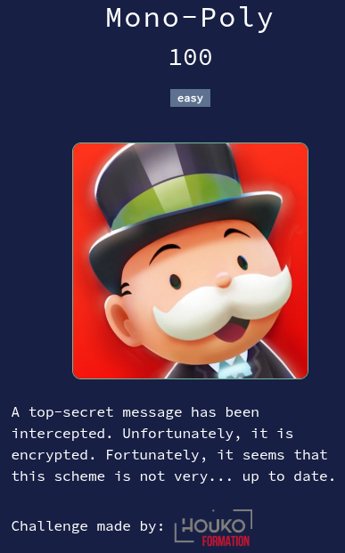

# Mono-Poly



## Files

* **ciphertext.txt**: challenge file

<details>
<summary>Solution</summary>

* After trying lots of tools, I finally found [Substitution Solver](https://www.guballa.de/substitution-solver) from "guballa.de" which solved the monoalphabetic substitution cipher in a few seconds.
* We obtain the following message:
    <details>
    <summary>Deciphered message</summary>

    ```
    HELLO DEAN,

    LOOK AT THIS !

    ---

    ALPHABETIC SUBSTITUTION IS ONE OF THE EARLIEST FORMS OF ENCRYPTION USED IN CLASSICAL CRYPTOGRAPHY. AT ITS CORE, IT IS A SIMPLE TECHNIQUE IN WHICH EACH LETTER OF THE PLAINTEXT IS REPLACED WITH ANOTHER LETTER FROM THE ALPHABET. THE MOST BASIC FORM IS THE MONOALPHABETIC SUBSTITUTION CIPHER, WHERE EACH LETTER IN THE ALPHABET MAPS TO A FIXED DIFFERENT LETTER. FOR EXAMPLE, IF ‘A’ IS SUBSTITUTED WITH ‘M’, THEN EVERY OCCURRENCE OF ‘A’ IN THE MESSAGE WILL BE ENCRYPTED AS ‘M’. THIS MAPPING REMAINS CONSTANT THROUGHOUT THE MESSAGE.

    ONE OF THE MOST FAMOUS MONOALPHABETIC SUBSTITUTION CIPHERS IS THE CAESAR CIPHER, ATTRIBUTED TO JULIUS CAESAR, WHO REPORTEDLY USED IT TO PROTECT MILITARY COMMUNICATIONS. THE CAESAR CIPHER SHIFTS EACH LETTER IN THE PLAINTEXT BY A FIXED NUMBER OF POSITIONS IN THE ALPHABET. FOR INSTANCE, WITH A SHIFT OF 3, ‘A’ BECOMES ‘D’, ‘B’ BECOMES ‘E’, AND SO ON.

    HOWEVER, WHILE MONOALPHABETIC SUBSTITUTION CAN OBSCURE A MESSAGE, IT IS VULNERABLE TO FREQUENCY ANALYSIS. IN ENGLISH, SOME LETTERS APPEAR FAR MORE OFTEN THAN OTHERS. THE MOST COMMON LETTERS, IN ORDER OF FREQUENCY, ARE E, T, A, O, I, N, S, H, AND R. BY ANALYZING THE FREQUENCY OF LETTERS IN AN ENCRYPTED MESSAGE, A CRYPTANALYST CAN MAKE EDUCATED GUESSES ABOUT THE SUBSTITUTION PATTERN. FOR EXAMPLE, IF A CERTAIN LETTER APPEARS MOST FREQUENTLY IN THE CIPHERTEXT, IT’S LIKELY TO CORRESPOND TO ‘E’ IN THE PLAINTEXT.

    TO COUNTER SUCH WEAKNESSES, CRYPTOGRAPHERS DEVELOPED MORE COMPLEX SYSTEMS LIKE THE VIGENERE CIPHER, A POLYALPHABETIC SUBSTITUTION CIPHER. UNLIKE THE MONOALPHABETIC CIPHER, THE VIGENERE CIPHER USES A KEYWORD TO DETERMINE THE LETTER SHIFT FOR EACH CHARACTER IN THE MESSAGE. THIS MEANS THE SAME LETTER CAN BE ENCRYPTED DIFFERENTLY DEPENDING ON ITS POSITION IN THE TEXT.

    THE VIGENERE CIPHER WORKS BY ALIGNING A KEYWORD WITH THE PLAINTEXT, REPEATING THE KEYWORD AS NECESSARY TO MATCH THE LENGTH OF THE MESSAGE. EACH LETTER OF THE KEYWORD THEN DETERMINES HOW MANY POSITIONS TO SHIFT THE CORRESPONDING PLAINTEXT LETTER. FOR INSTANCE, IF THE KEYWORD IS "KEY" AND THE PLAINTEXT IS "HELLO", THE CIPHER WOULD PROCEED AS FOLLOWS:

    H + K → R

    E + E → I

    L + Y → J

    L + K → V

    O + E → S

    THUS, "HELLO" BECOMES "RIJVS". SINCE THE SHIFTS VARY BASED ON THE KEYWORD, THE VIGENERE CIPHER RESISTS FREQUENCY ANALYSIS MORE EFFECTIVELY THAN MONOALPHABETIC CIPHERS. THE REPEATING PATTERN INTRODUCED BY THE KEYWORD DISRUPTS PREDICTABLE FREQUENCY DISTRIBUTIONS, MAKING IT HARDER TO MATCH THE COMMON LETTERS E, T, A, O, I, N, S, H, R TO THEIR CIPHERTEXT COUNTERPARTS.

    ---

    I FOUND THIS VERY INTERESTING, SO I ENCRYPTED OUR SECRET A SECOND TIME, IT'S MUCH SAFER ! HERE IS THE FLAG : ICO{BSUTJI_EFAVYHRMOF_DSR_LFI_WAL}

    BYE,
    MATT
    ```

    </details>
* Well, let's try to use the same alphabetic substitution to decrypt the flag: `ICO{BSUTJI_EFAVYHRMOF_DSR_LFI_WAL}`
  * It doesn't work.
* But wait, Vigenère cipher is mentioned in the text.
* Let's use [Vigenere Cipher Solver](https://www.dcode.fr/vigenere-cipher) from "dcode.fr".
  * Use the setting `Knowing a plaintext word:` with input `ECW{` (the beginning of the flag).
  * The flag is on the first results with key `EASY`.

Flag : `ECW{DOUBLE_ENCRYPTION_FOR_THE_WIN}`

</details>