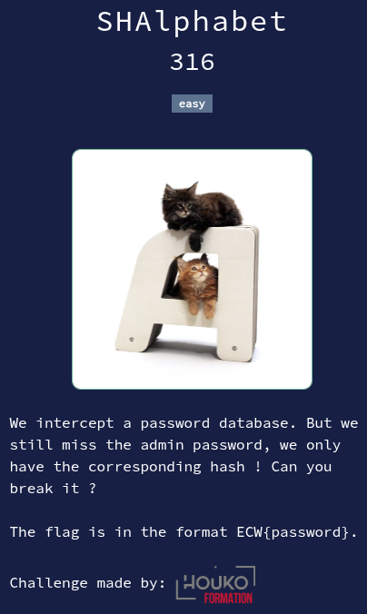

# Mono-Poly



## Files

* **database.txt**: challenge file
* **hash**: challenge file
* **solve.py**: SOLUTION script
* **v1_solve.py**: SOLUTION script (first attempt)

<details>
<summary>Solution</summary>

* We are presented with a hash and a database of words (with their hashes).
* First thing to check : which hash algorithm is used ? Using [this tool](https://hashes.com/en/tools/hash_identifier), we find out it is SHA256.
* We suppose the words are generated from common parts.
  * We proceed to give the database to Perplexity, asking for the smallest common parts.
* We then write a first script to "bruteforce" the password by concatenating the common parts and checking if the hash matches.
  * It does not find the password, or run indefinitely.
* We then optimize (thanks to the LLM) the script by prioritizing according to the frequency of appearance of the parts in the database.
  * We had to expand the `max_attempts` which was originally set to 1 million, to 30 million.
* Our new script finds the password quickly :
  ```
  [!] Found! Original word: ringckouck
  [i] Total attempts: 8 930 847
  [i] Time taken: 1 minute 31 seconds
  ```
* It's a question of luck, here is a second run :
  ```
  [!] Found! Original word: ringckouck
  [i] Total attempts: 1 903 723
  [i] Time taken: 18 seconds
  ```

Flag : `ECW{ringckouck}`

</details>