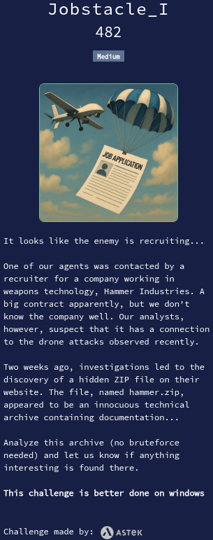

# Jobstacle_I



## Files

* **hammer.zip** : challenge file

<details>
<summary>Solution</summary>

* This challenge requires multiple steps. Let's split it into parts.
* We did the challenge in Ubuntu, despite the challenge description mentioning Windows. It is not a problem, as we will see.

## Part 1 : Crack zip archive

* We have a zip file, password protected. We should not use bruteforce.
* After exploring the archive for a while, we remember about some unsecure encryption methods used for archive files.
  * We look for `old broken zip encryption` on Google.
  * We find the following article : [Cracking encrypted archives (PKZIP: Zip ZipCrypto, Winzip: Zip AES, 7 Zip, RAR)](https://www.acceis.fr/cracking-encrypted-archives-pkzip-zip-zipcrypto-winzip-zip-aes-7-zip-rar/)
  * Interesting !
* We do have a svg file in the zip file. Let's check the encryption method :
    ```bash
    $ 7z l -slt hammer.zip | grep Method
    Method = ZipCrypto Store
    ```
* So, we can definitely use the method in the article !
* It is a kind of known-plaintext attack :
  * We know the archive contains a svg file, which header starts probably with `<?xml version="1.0" ...`
  * And we can find the CRC of the svg file.
  * Let's use [**bcrack**](https://github.com/kimci86/bkcrack) tool like in the article.
* We first extract the artifacts :
    ```bash
    $ printf '<?xml version="1.0"' > plain.svg
    $ 7z l -slt hammer.zip Hammer_industries.svg | grep CRC
    CRC = D50FB11D
    ```
* Let's start key recovery :
    ```bash
    $ ./bkcrack -C hammer.zip -c Hammer_industries.svg -p plain.svg -x -1 D5
    bkcrack 1.8.0 - 2025-08-18
    [00:29:07] Z reduction using 12 bytes of known plaintext
    100.0 % (12 / 12)
    [00:29:07] Attack on 590556 Z values at index 6
    Keys: 0b717953 f2bdfe0b 514d8424
    36.2 % (213755 / 590556)
    Found a solution. Stopping.
    You may resume the attack with the option: --continue-attack 213755
    [00:49:05] Keys
    0b717953 f2bdfe0b 514d8424
    ```
* We can now craft a new zip with any password we want, using the recovered keys :
    ```bash
    $ ./bkcrack -C hammer.zip -k 0b717953 f2bdfe0b 514d8424 -U cracked.zip 1234
    bkcrack 1.8.0 - 2025-08-18
    [01:17:54] Writing unlocked archive cracked.zip with password "1234"
    100.0 % (4 / 4)
    Wrote unlocked archive.
    ```
* We then proceed to extract the new archive with our password `1234`.

## Part 2 : Analyze the archive's files

* Of course, the flag is not directly in any of the files.
  * Neither in the metadata or stream/strings.
* Remember however : word documents are actually a kind of zip files.<br>
    
* We browse both document with binwalk.
* We find something suspicious in `USDroneLaws.docx`
    ```bash
    $ binwalk USDroneLaws.docx 
    DECIMAL       HEXADECIMAL     DESCRIPTION
    --------------------------------------------------------------------------------
    0             0x0             Zip archive data, at least v2.0 to extract, compressed size: 183, uncompressed size: 289, name: customXml/item1.xml
    272           0x110           Zip archive data, at least v2.0 to extract, compressed size: 224, uncompressed size: 341, name: customXml/itemProps1.xml
    590           0x24E           Zip archive data, at least v2.0 to extract, compressed size: 194, uncompressed size: 296, name: customXml/_rels/item1.xml.rels
    1108          0x454           Zip archive data, at least v2.0 to extract, compressed size: 389, uncompressed size: 729, name: docProps/app.xml
    1807          0x70F           Zip archive data, at least v2.0 to extract, compressed size: 361, uncompressed size: 726, name: docProps/core.xml
    2479          0x9AF           Zip archive data, at least v2.0 to extract, compressed size: 13034104, uncompressed size: 138412032, name: word/disk_fefe.xml
    13036631      0xC6EC57        Zip archive data, at least v2.0 to extract, compressed size: 336599, uncompressed size: 3292368, name: word/document.xml
    ```
    > uncompressed size: **138412032**, name: word/**disk**_fefe.xml
    * Wait... A file named disk of 138MB ?!<br>
        
* We extract the file and analyze it with `file` command :
    ```bash
    $ unzip USDroneLaws.docx word/disk_fefe.xml -d .
    $ file disk_fefe.xml
    disk_fefe.xml: Microsoft Disk Image eXtended
    ```
* This is definitely not some xml file ! Let's double check.
    ```bash
    $ qemu-img info disk_fefe.xml 
    image: disk_fefe.xml
    file format: vhdx
    virtual size: 100 MiB (104857600 bytes)
    disk size: 132 MiB
    cluster_size: 33554432
    Child node '/file':
        filename: disk_fefe.xml
        protocol type: file
        file length: 132 MiB (138412032 bytes)
        disk size: 132 MiB

    $ mv disk_fefe.xml disk_fefe.vhdx
    ```
* So this is a VHDX file. Let's mount it.
    ```bash
    sudo modprobe nbd max_part=8
    sudo qemu-nbd --connect=/dev/nbd0 --read-only disk_fefe.vhdx
    ```
* We mounted the file read-only to avoid any modification. Let's now copy the files elsewhere.
  * We also check that the virtual disk does not contain any deleted files with `testdisk`.
* We can then unmount the image.
    ```bash
    sudo umount /dev/nbd0p1
    sudo qemu-nbd --disconnect /dev/nbd0
    ```
* Here is what we have so far :
    <details>
    <summary>Tree of the extracted files</summary>

    ```
    .
    ├── stage1
    │   ├── Application-Form.pdf
    │   ├── disk_fefe.vhdx
    │   ├── Hammer_Industries.docx
    │   ├── Hammer_industries.svg
    │   └── USDroneLaws.docx
    └── stage2
        ├── $RECYCLE.BIN
        │   └── S-1-5-21-3058106134-1388677725-471704530-1002
        │       └── desktop.ini
        ├── OPERATION.pdf
        ├── Private_Viewing
        │   ├── Base64.pdf
        │   ├── elec-diagram.webp
        │   ├── R45T3K7.txt
        │   ├── ROT13.pdf
        │   ├── unit-dimension.jpg
        │   ├── куча металлолома.gif
        │   └── план разведки.png
        ├── System Volume Information
        │   ├── IndexerVolumeGuid
        │   └── WPSettings.dat
        └── team-compo.docx

    7 directories, 17 files
    ```

    </details>

## Part 3 : Explore the VHDX image

* Let's browse the different files.
  * Of course, no immediate flag.
* We see interesting files in `Private_Viewing` folder.
  * ROT13.pdf
  * Base64.pdf
  * R45T3K7.txt
  * The most interesting is the text file. Here is it's content :
    ```
    You will find in this folder the elements necessary to the smooth unfolding of the operation.
    ```
* But of course... No immediate sight of something resembling base64.
* After using all the imaginable commands (strings, exiftool, outguess, pdf-parser, binwalk, etc.), still nothing.<br>
    <br>
    *Where flag?*
* We decide to do scripting to extract and attempt to decode any base64-looking string.
  * See [decode.py](decode.py).
* We start by looking in stage2 folder, unziping docx files so we can look in all the xml files.
  * Nothing.
* We then proceed to stage1 folder :
    ```bash
    $ unzip USDroneLaws.docx -d USDroneLaws_unzip/
    $ unzip Hammer_Industries.docx -d Hammer_Industries_unzip/
    ```
* Let's find any base64-looking string in all the files :
    ```bash
    $ grep -rao --binary-files=text -E '[A-Za-z0-9+/]{12,}={0,2}' . | awk -F: '{$1=""; sub(/^:/,""); print}' | sort -u > strings.txt
    ```
    * -r : recursive
    * -a : treat binary files as text
    * -o : print only the matched (non-empty) parts of a matching line, with each such part on a separate output line
    * -E : use extended regex
    * `[A-Za-z0-9+/]{12,}={0,2}` : regex for base64 strings of at least 12 characters
    * `awk -F: '{$1=""; sub(/^:/,""); print}'` : remove the filename part added by grep
    * `sort -u` : sort and remove duplicates
    * `> strings.txt` : output to file strings.txt
* We then launch our decoding program and get an interesting output :
    ```
    $ python3 decode.py
    [BASE64] BBBBBBBBBBBBBBBBBBBBBBBBBBBB => AAAAAAA
    ...
    [BASE64] UlBKe3pwcTBfcGU0cHh9 => RPJ{zpq0_pe4px}
    ...
    ```
* That looks like a flag ! Let's apply ROT13 on it. (CyberChef)
* Bingo.

Flag : `ECW{mcd0_cr4ck}`

</details>