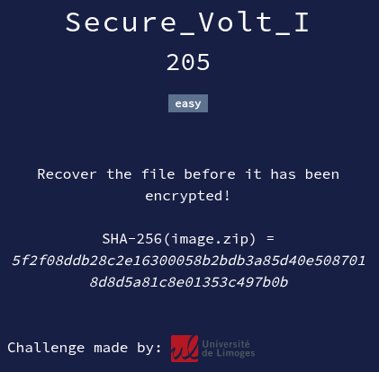

# Secure_Volt_I



## Files

* [**secure_vault_I.zip**](https://mega.nz/file/QcgUSAjL#QxSC3I9T-qb9WgUMtmu40ZKanfKWGEf8oJAkW0asHvg): challenge file
  * *Uploaded to Mega as it is large (~600 MB)*
  * You can check the integrity of the file using sha256sum:
    ```
    sha256sum -c sha256sum.txt
    ```

<details>
<summary>Solution</summary>

* Unzip the file to get `image.raw`.
* We try `testdisk` with no luck. Autopsy cannot open it either.
  * `photorec` finds tons of files but nothing looks of interest.
* We try file command:
    ```sh
    $ file image.raw
    image.raw: Windows Event Trace Log
    ```
* However, opening it with `tracerpt` does not work.
* Last thing to try is `volatility` (if this is a memory dump)
* We can use `volatility` to analyze the memory dump:
    ```sh
    $ vol -f image.raw windows.info
    ```
    ... which gives us some output about the system and no errors. Great!
* Let's explore the command line of the processes:
    ```sh
    $ vol -f image.raw windows.cmdline
    ```
* We can see an interesting python script being executed:
    ```
    4936	python.exe	C:\Users\crypto\AppData\Local\Programs\Python\Python313\python.exe  encrypt.py
    ```
* Let's find the adress of the `encrypt.py` file:
    ```sh
    $ vol -f image.raw windows.filescan | grep "encrypt.py"
    0xbd06170982c0.0\Users\crypto\Desktop\encrypt.py
    0xbd061965fc50	\Users\crypto\Desktop\encrypt.py
    ```
* Now we can dump the file:
    ```sh
    vol -f image.raw -o ./volexport/ windows.dumpfiles --virtaddr 0xbd06170982c0
    ```
* Great, we now have the encryption code which is as follow:
    <details>
    <summary>encrypt.py</summary>

    ```python
    from Crypto.Hash import SHA3_512
    from Crypto.Cipher import AES

    filename = "0TT4fjq1BN8k.png"

    #SHA3-512 so very secure! :)
    def very_secure_hash(state):
        h = SHA3_512.new()
        h.update(state)
        return h.digest()[:6]

    steps = 306210010937948737844847939557021440793	

    state = bytes.fromhex("67342b2ebc70")

    for i in range(steps):
        state = very_secure_hash(state)

    key = state + state + state[:4]
    nonce = bytes.fromhex("cafedecadeadbeef8badf00d000ff1ce")
    cipher = AES.new(key, AES.MODE_GCM, nonce=nonce)
    open(filename + ".enc", "wb").write(cipher.encrypt(open(filename, "rb").read())
    ```

    </details>
    
  * Don't be scared by this gibberish, the only thing that interests us is the filename: `0TT4fjq1BN8k.png`.
* We can now search the file adress and dump it as above:
    ```sh
    $ vol -f image.raw windows.filescan | grep "0TT4fjq1BN8k.png"
    0xbd0616e80d20.0\Users\crypto\Desktop\0TT4fjq1BN8k.png
    0xbd0618b728f0	\Users\crypto\Desktop\0TT4fjq1BN8k.png
    
    $ vol -f image.raw -o ./volexport/ windows.dumpfiles --virtaddr 0xbd0616e80d20
    ```
* And here is our flag !<br>
    

Flag : `ECW{F0renS1c_is_s0_Much_fUn!!!}`

</details>