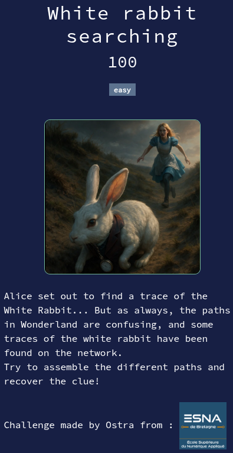

# White rabbit searching

## Files

* **Searching_this_rabbit.pcap**: challenge file

Solution

* We open the pcap file with Wireshark.
* After browsing the packets for a while, we find some interesting DNS queries to non-existent domains, e.g. `GVfcmF.white-rabbit.fr`
* One particular catches our attention : `RUNXe0.white-rabbit.fr`
  * Why ? Because the base64 of `ECW{` starts with `RUNXe` !
* So, using the search function of Wireshark, we search for `No such name`.
  * Here is a [tutorial to do so](https://www.cellstream.com/2019/09/26/finding-text-strings-in-wireshark-captures/).
* We then reconstruct the flag by concatenating the different subdomains, and decoding base64 with [CyberChef](https://gchq.github.io/CyberChef/).

Flag : `ECW{Follow_the_white_rabbit}`

