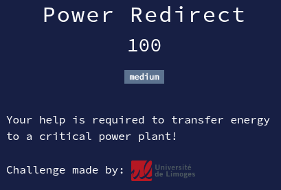

# Power Redirect



## Files

* **power_control**: challenge file (ELF binary)

<details>
<summary>Solution</summary>

* We open the program in IDA.
* First, we open the "Strings" subview to see if there are interesting strings.
* We understand this programs is a kind of puzzle game.
* We then proceed to open the program in Ghidra to have a better view of the functions.
* We give the decompiled main function to ChatGPT to rewrite it nicely for us humans :
    <details>
    <summary>Decompiled main function</summary>
        
    ```c
    #include <stdio.h>
    #include <stdlib.h>

    int checkstate(int *state);
    void printState(int *state);
    int updateState(int *state, char from_ch, char to_ch);

    int main(void)
    {
        int state[9] = { 3, 2, 1, 0, 0, 0, 0, 0, 0 }; /* 3 towers × 3 slots: index = tower*3 + slot (slot 0 = bottom) */
        char a, b;
        int r;

        puts("Welcome! You can manage the energy stored in power plants by transferring it from one to another.");
        puts("A command contains two digits: the departure and the destination.");
        puts("For example, command 12 transfers energy from power plant 1 to power plant 2.");
        puts("Your goal is to route all the energy to power plant number 3!");

        while (!checkstate(state)) {
            printState(state);
            printf("Enter command:");
            if (scanf(" %c%c", &a, &b) != 2) {
                int c;
                while ((c = getchar()) != EOF && c != '\n') { }
                puts("Invalid input...");
                continue;
            }
            getchar(); /* consume newline if present */

            if (a < '1' || a > '3' || b < '1' || b > '3') {
                puts("Invalid command...");
                continue;
            }

            r = updateState(state, a, b);
            if (r == -1) {
                puts("Impossible to transfer energy.");
            }
        }

        puts("Well done! The flag is ECW{commands}, where commands is the shortest sequence of instructions  to complete the challenge!");
        return 0;
    }
    ```
    
    </details>

* After giving the code of function updateState, we ask which is the shortest sequence of commands to reach the goal.
* ChatGPT gives us the answer : `13 12 32 13 21 23 13`
* We test it and it works !

Flag : `ECW{13123213212313}`

</details>