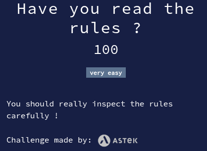

# Have you read the rules?

Solution

* View source of the page (either `CTRL+U` or right click -> "View page source")
* We spot a suspicious base64 string: `RUNXe1llc0lIYXZlUmVhZEFuZElVbmRlcnN0YW5kQW5kSUFjY2VwdEFsbFRoZVJ1bGVzfQ==`
* Turns out to be the flag: `ECW{YesIHaveReadAndIUnderstandAndIAcceptAllTheRules}`

